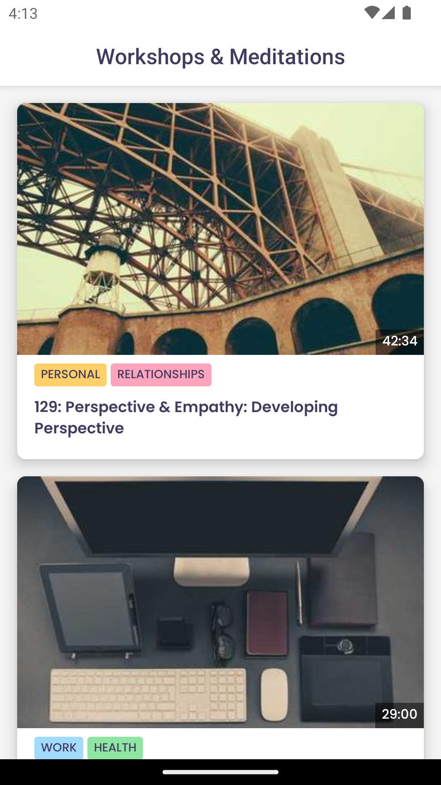
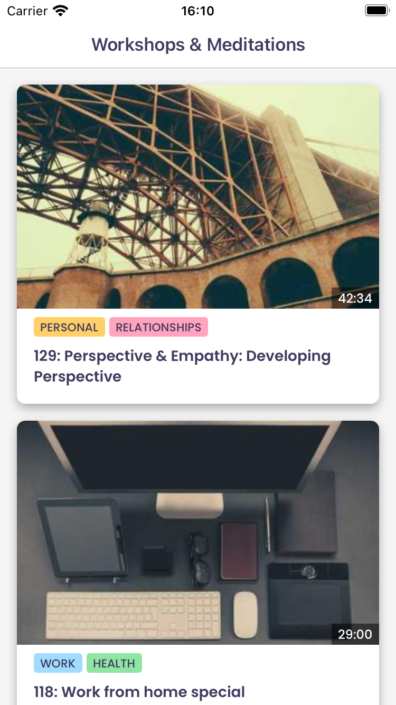
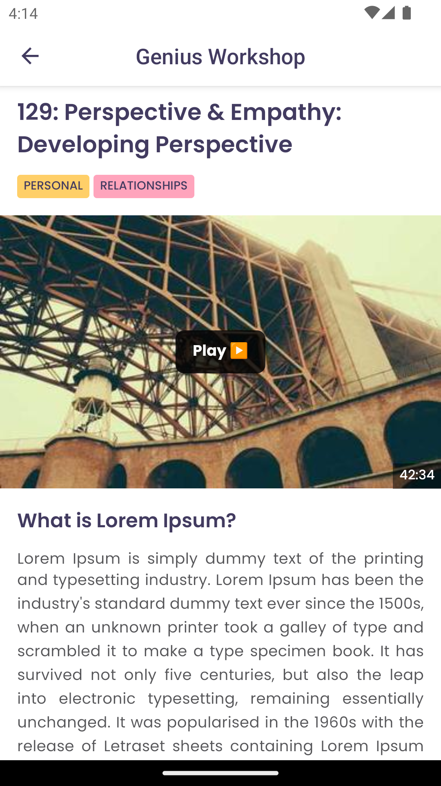
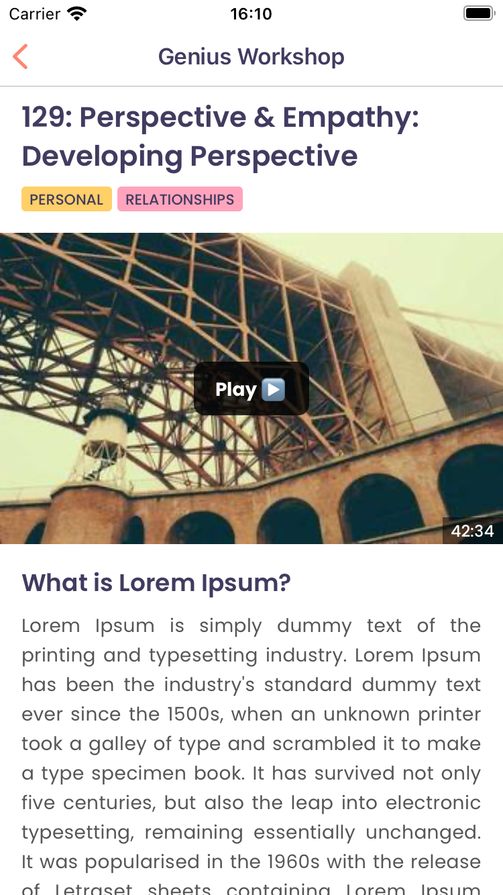

# Assignment requirement

> Create a simple React Native component displaying a workshop list.
> Each item should be clickable, leading to a mock detail view with static text.
> Focus on the component structure and navigation.
> Briefly explain your approach and any React Native libraries used for navigation.

## Result screenshot

| Context          | Android                                          | iOS                                          |
| ---------------- | ------------------------------------------------ | -------------------------------------------- |
| Workshop listing |     |     |
| Workshop details |  |  |

## Assignment approach breakdown

### Component structure

Most of the source code is in the `src` directory. Subdirectories are used to organize the code based on their domain.

- `src/design` contains the design tokens.
- `src/navigation` contains the navigation related code, including the navigation stack and the navigation types.
- `src/shared` contains the shared components and utilities.
- `src/workshops` contains the workshop business code. This includes the API, the hooks, and the components, screens, etc.

If there are more features, I would create a new directory for each feature and organize the code based on the feature. Eg. `src/courses` or `src/learning`.

### Navigation setup

I use `react-navigation` for navigation. It is a popular library for navigation in React Native. It is easy to use and has a good community support.

The app consists of two screens: `Workshops` and `WorkshopDetails`. I use a `StackNavigator` to navigate between these two screens.

The route's params are strongly typed, defined in `src/navigation/types/RootStackParamList.ts`.
This is to ensure that the route's params are correctly passed when navigating.

There is also the `ScreenProps` type defined in `src/navigation/types/ScreenProps.ts`. This utility type is used to help the screen to access the navigation props and route's params.

### Asynchronous state management

To managed the async state of the data fetching, I use `react-query` library. It is a popular library for managing the async state of the data fetching.

### Mock data

The data is returned from a mock API in the `src/workshops/workshopsApi.ts`. This is to simulate the data fetching from an API.

The sample data is based on [Jay Shetty Genius website](https://www.jayshettygenius.com/)

### Workshop listing screen

The `Workshops` screen is a simple screen that use `WorkshopList` component to displays a list of workshops.

The `WorkshopList` component uses the `FlatList` component to display the Workshop items. The `FlatList` component is a performant way to display a large list of items.

The logic to fetch the workshops is handled by the `useFetchWorkshops` hook. This hook uses `useInfiniteQuery` to fetch continuous data from the API.

Each workshop item display an video thumbnail, tags and title.

Pressing on a workshop item will navigate to the `WorkshopDetails` screen with the workshop's id as the route's param.

### Workshop listing screen

The `WorkshopDetails` screen displays the workshop's details.

The workshop's details are fetched from the `useWorkshopDetails` hook. This hook uses `useQuery` to fetch the workshop's details from the API.

Once the data is fetched, the workshop's details are displayed on the screen.

# Run the project

> **Note**: Make sure you have completed the [React Native - Environment Setup](https://reactnative.dev/docs/environment-setup) instructions till "Creating a new application" step, before proceeding.

## Step 1: Start the Metro Server

To start Metro, run the following command from the _root_ of your React Native project:

```bash
yarn start
```

## Step 2: Start your Application

Run the following command to start your _Android_ or _iOS_ app:

### For Android

```bash
yarn android
```

### For iOS

```bash
yarn ios
```
